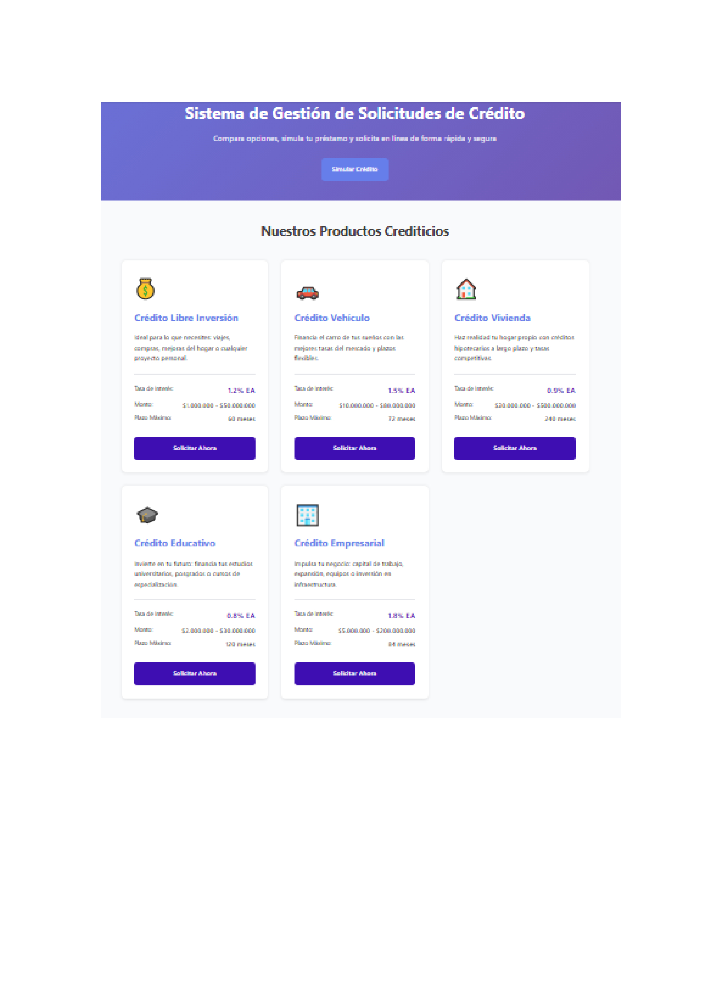

#  CreditSmart - Sistema de Gestión de Solicitudes de Crédito

##  Información del Estudiante

**Nombre:** Daniela Jimenez
**Código:** PREICA2502B020022 
**Programa:** Ingeniería Web I  
**Semestre:** 2025-2  
**Universidad:** universidad digital de antioquia

---

##  Descripción del Proyecto

CreditSmart es una plataforma web desarrollada para **FinTech Solutions S.A.S** que permite a los usuarios:

-  Consultar opciones de crédito disponibles
-  Simular préstamos 
-  Solicitar créditos en línea 

El sistema gestiona **5 tipos de productos crediticios**: Crédito Libre Inversión, Crédito Vehículo, Crédito Vivienda, Crédito Educativo y Crédito Empresarial.

---

##  Estructura de Archivos
```
CreditSmart
├── index.html          # interfaz  principal 
├── simulador.html      # búsqueda y filtros
├── solicitar.html      # Formulario de solicitud de crédito
├── css/
│   └── styles.css      # Archivo de estilos CSS3
├── images/             # Carpeta para imágenes del proyecto
└── README.md           # Documentación del proyecto 
```

---

##  Instrucciones para Ejecutar el Proyecto

### Opción 1: Abrir directamente en el navegador
1. Descarga o clona este repositorio
2. Navega hasta la carpeta del proyecto
3. Haz doble clic en el archivo `index.html`
4. El sitio se abrirá en tu navegador predeterminado

### Opción 2: Usar Live Server en VS Code (Recomendado)
1. Abre el proyecto en Visual Studio Code
2. Instala la extensión "Live Server"
3. Haz clic derecho en `index.html`
4. El sitio se abrirá automáticamente 

---

##  Capturas de Pantalla

### Interfaz Principal - Catálogo de Créditos


### Formulario de Crédito


### Simulador de Solicitud


---

##  Tecnologías Utilizadas

- **HTML5** - Estructura semántica del sitio
- **CSS3** - Diseño y estilos profesionales
- **CSS Grid** - Sistema de layout responsive
- **CSS Flexbox** - Alineación y distribución de elementos
- **Media Queries** - Diseño responsive para móviles y tablets

---

##  Características Implementadas

- HTML5 Semántico (header, nav, main, section, article, footer)  
- CSS3 Profesional con variables CSS  
- Diseño Responsive (Desktop, Tablet, Móvil)  
- Navegación funcional entre páginas  
- 5 productos crediticios con información completa  
- Formulario con validación HTML5  
- Filtros de búsqueda (interfaz visual)  
- Código organizado  


=======

 Email: [stephanni.jimenez@est.iudigital.edu.co]  
 GitHub: [daniJN]

